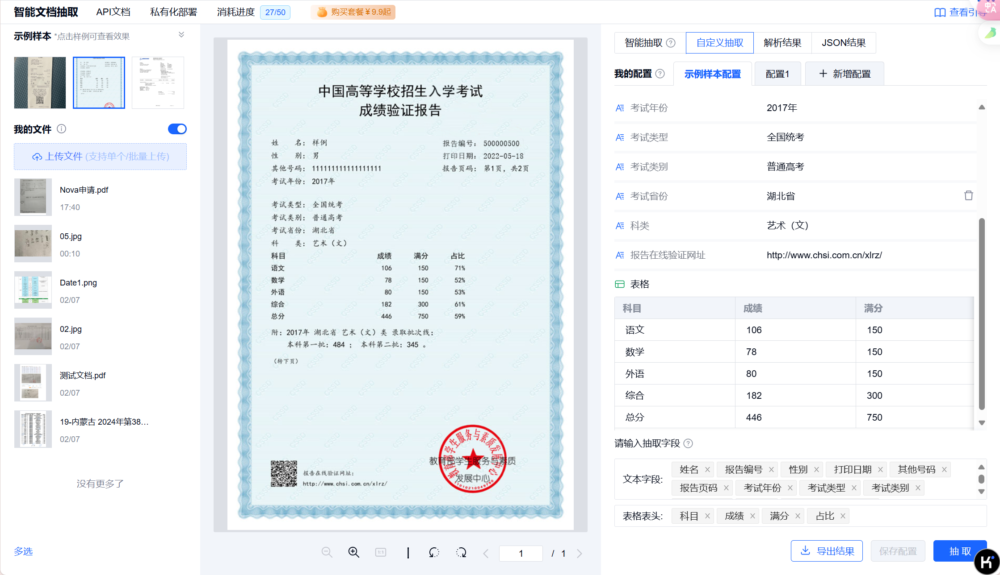

# TextIn API 调用 Demo

## 使用方法
1. 获取API密钥
   - 访问 TextIn 控制台: https://www.textin.com/console/dashboard/setting
   - 获取 x-ti-app-id 和 x-ti-secret-code
   - 在 `Client/config.conf` 中填入这些密钥
   - 注意: 需要先开通以下两个服务:
     - [表格识别服务](https://www.textin.com/document/recognize_table_multipage?from=toolstextin-seo-pc)
     - [智能文档提取服务](https://www.textin.com/document/open_kie_vlm_engine)

2. 配置文件
   - 在 `Client` 目录下创建 `config.conf` 文件，并填入以下内容：
     ```
     [API]
     x_ti_app_id = your_app_id_here
     x_ti_secret_code = your_secret_code_here
     ```

3. 安装依赖
   ```shell
   pip install jsonpath pandas requests
   ```

4. 运行程序
   ```shell
   python Client/Client_main.py
   ```

## 目录结构

主要的代码都在 `Client` 文件夹里面

- `Client_main.py` 主函数
- `Client_Extract.py` 智能文档提取
- `Client_Recognize.py` 表格识别
- GUI 待完成

`Client_Recognize.py` 是可以设置导出 Excel 的三种方法的，你可以具体去看 API 的说明。

多说一下智能提取，就是这里面的 `fields_key` 是如果你的一个图片或者一整个文档只有一个字段的一个信息话，你可以用来提取；然后 `table_key` 是如果你的一个图片或者一整个文档有一个字段的多个信息话，你可以用来提取。或者你可以直接上他的体验馆你就知道是干啥的了（两个可以指定一个即可，也可以都指定） https://www.textin.com/console/recognition/robot_document_extract?service=open_kie_vlm_engine

- 在我目前的代码里面，默认所有的都会合并，所有的 `fields_key` 提取的合并到一起，所有的 `table_key` 的信息放到一起



- 测试智能提取用的图片在 `Test_Extract` 和 `Test_Extract_Tickets` 文件夹下面，前者的输出在 `Output_Extract` 下面。`Output` 里面的是每个图片的单独的输出结果
- 测试表格识别用的图片在 `Test_Table` 文件夹下面，输出在 `OutPut_Table` 里面
- 中间我有些调试的用来输出 JSON 的代码我注释掉了，你想要看的话可以解开

## 目前的问题


- 确实需要图片预处理，果然 CAC 说的是对的，当图片有水印、结构不够工整、图片不清晰、图片里面的信息过于庞大的时候，识别效果会很差（可以参考 `Test_Extract` 文件夹下面的图片）

## 需要的改进
1. 做图片的预处理，比如去水印或者增加清晰度。其实只用到时候把处理好的图片的信息传给我的 OCR 类就行了
2. 可以考虑把 PDF 和 Word 拆成一张张图片传，然后把大图片想办法拆开了传？（不知道可行不可行）。因为如果 PDF 过大的话或者过长，一个是准确度会下降，再一个就是他 API 本身就有长度的限制。


> By SweetGargamel